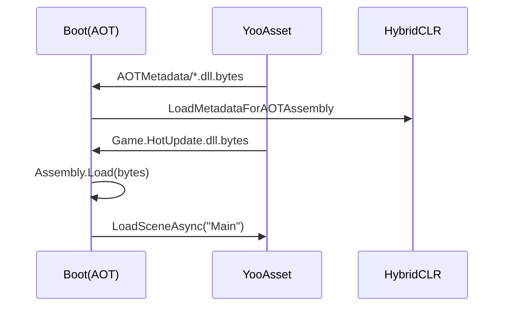

# HybridCLR 基础 {#hybridclr}

HybridCLR 让 IL2CPP 客户端在运行时加载新的托管 DLL。理解 AOT 与 HotUpdate 的
边界，是选择发布类型的关键。

## AOT 与热更程序集

- **AOT 程序集**：随 Player 被 IL2CPP 转成原生代码，例如 Boot 与框架运行时。
- **HotUpdate 程序集**：以 `Game.HotUpdate.dll.bytes` 作为 YooAsset 资源下载，
  启动时加载，适合业务逻辑。
- **补充元数据**：裁剪后的 AOT DLL 字节，用于补足泛型元数据，不等于替换 AOT 原生代码。

## 什么可以 HotUpdateOnly

业务脚本、Main/UI/音频/配置等资源通常可以热更新。Unity 原生 Player 设置、插件、
启动 AOT 代码、IL2CPP 生成代码或签名变化需要 Full Package。

如果当前 AOT 输出和历史基线不同，工具会强警告但允许继续 HotUpdateOnly。原因是：
一次误改或换行不应让已发布客户端失效。不过，本次热更仍必须使用**目标旧客户端**
对应的 AOT 补充元数据；新 AOT 能编译不代表旧客户端有对应原生实现。

## 程序集边界原则

- Boot、下载、校验、安装器接口放 AOT。
- 可迭代玩法、UI 控制器、业务服务放 `Game.HotUpdate`。
- 热更代码可以引用 AOT，AOT 不能静态引用只存在于热更 DLL 的具体类型。
- 场景上的热更 MonoBehaviour 类型和字段名应保持可迁移，重命名要处理序列化兼容。

完整客户端升级详见[客户端整包更新](../release/client-update.md)。
