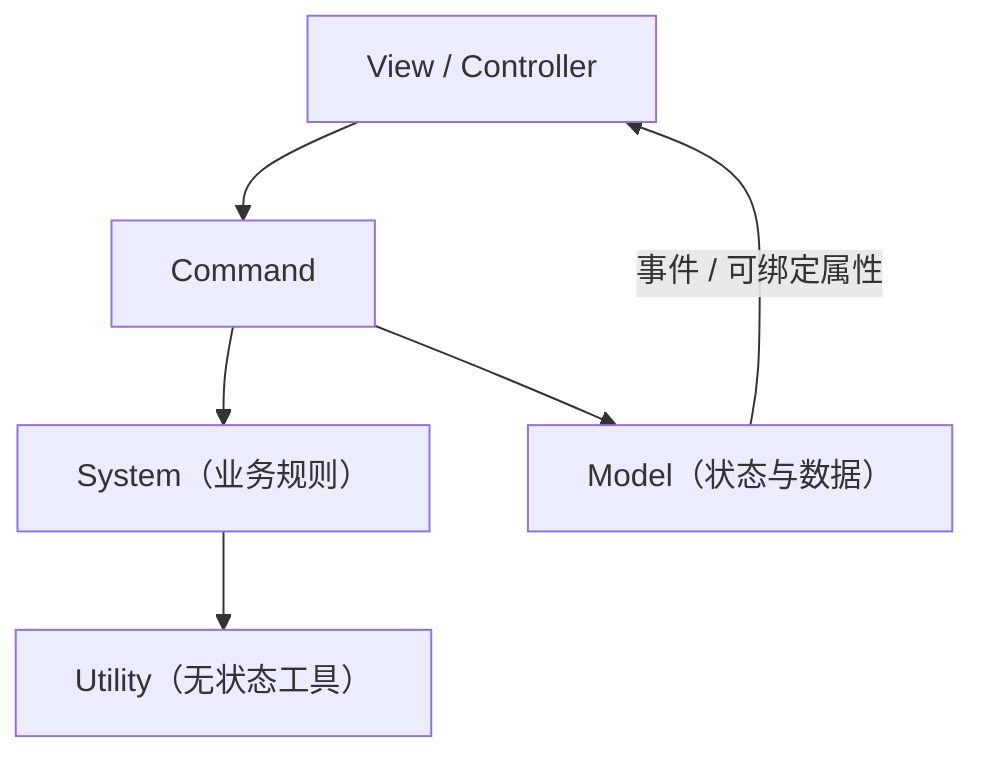

# QFramework 基础 {#qframework}

QFramework 负责业务架构和上层调用习惯。QHY Framework 不修改其源码，而是在
扩展点安装 YooAsset 适配器。

## 架构分层



- **Model**：保存长期状态，不直接操作 UI。
- **System**：组织业务规则和跨 Model 行为。
- **Command**：表达一次用户意图，适合测试和组合。
- **Utility**：文件、加密等无状态能力。
- **事件**：解耦发送者与接收者；不再使用时必须注销。

```csharp
public interface IGameArchitecture : QFramework.IArchitecture {}

public sealed class GameArchitecture : QFramework.Architecture<GameArchitecture>, IGameArchitecture
{
    protected override void Init()
    {
        RegisterModel(new PlayerModel());
        RegisterSystem(new SaveSystem());
    }
}
```

## ResKit：调用不变，来源已变

```csharp
using QFramework;
using UnityEngine;

var loader = ResLoader.Allocate();
var prefab = loader.LoadSync<GameObject>("Player");
var instance = Object.Instantiate(prefab);

// 页面/对象销毁时成对释放
loader.Recycle2Cache();
loader = null;
```

`ownerBundle` 参数为了兼容旧代码仍可传入，但不会参与 YooAsset Bundle 定位。
资源的短名会解析为 Address。网络图片与本地图片仍由 QFramework 原加载器处理。

## UIKit 与 AudioKit

```csharp
UIKit.OpenPanel<LoginPanel>();
AudioKit.PlaySound("ButtonClick");
AudioKit.PlayMusic("BgmLobby", loop: true);
```

QHY Framework 在 Boot 安装 UIKit Root/Panel Loader 与 Audio Loader Pool，因此
这些调用不会再经过 `Resources.Load` 或旧 AssetBundle。Prefab/AudioClip 必须被
YooAsset 收集并拥有匹配 Address。

## 常见误区

- 不要在每帧创建 `ResLoader`。
- 不要释放 Loader 后继续使用返回的资源。
- QFramework 原生场景扩展内部没有无侵入替换点；业务场景使用
  `YooAssetSceneKit`，见[场景开发](../development/scenes.md)。
