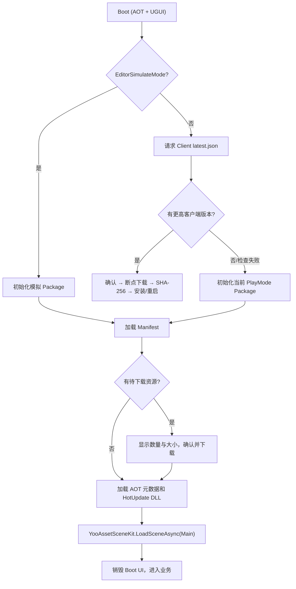
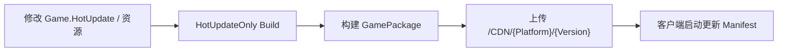
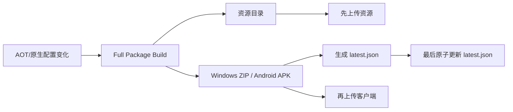

# QHY 启动与更新流程 {#qhy-workflows}

## 启动总流程

客户端检查失败不会封锁旧客户端；资源远端请求失败则优先回退本地缓存。若检测到
强制客户端新版，用户确认前不能进入 Main。

## 热更新发布流

HotUpdateOnly 不改变客户端版本，也不更新 `/Client/.../latest.json`。

## 完整客户端发布流

最后更新 `latest.json` 避免客户端看到尚未上传完成的新包。服务器必须继续保留旧
资源目录。
