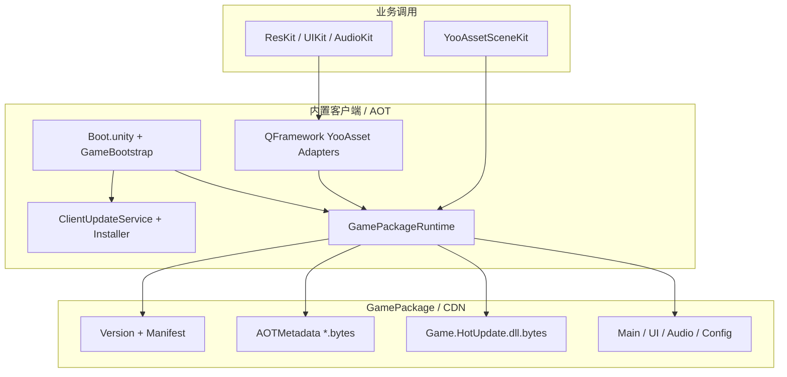

# 架构与边界 {#architecture}

## 所有权

| 层 | 所有者 | 可热更新 |
|---|---|---|
| QFramework/HybridCLR/YooAsset 包 | 上游依赖 | 不直接修改 |
| QHY AOT Runtime 与 Editor | QHY UPM 包 | 需升级客户端/包 |
| Boot 场景与 BootUI Prefab | 宿主项目 | Full Package |
| Game.HotUpdate 与 Content | 游戏业务 | HotUpdateOnly |
| FTP/CDN/客户端产物 | 发布运维 | 按版本保留 |

适配层只利用公开配置/工厂/Loader 扩展点，因此业务侧的 QFramework 资源、UI、音频
调用保持一致。
