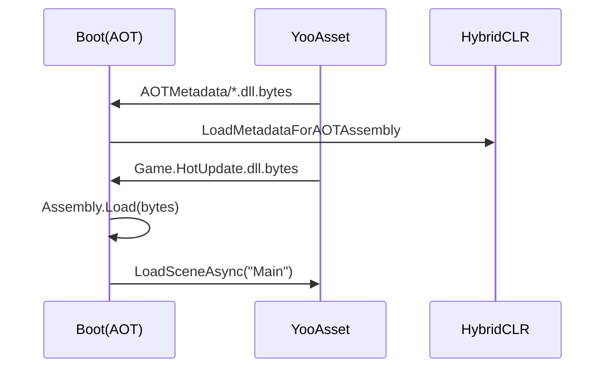

# HybridCLR fundamentals {#hybridclr}

- **AOT assemblies** are converted to native code by IL2CPP.
- **HotUpdate assemblies** are downloaded as YooAsset resources and loaded at runtime.
- **Supplemental metadata** supplies generic metadata; it does not replace native AOT code.

Gameplay code and remote content usually use HotUpdateOnly. Boot, native
plugins, Player settings, and IL2CPP changes require Full Package.

An AOT difference produces a strong warning but does not block HotUpdateOnly.
You must still use metadata compatible with the target published client and
must not call new native AOT implementations that client does not contain.
