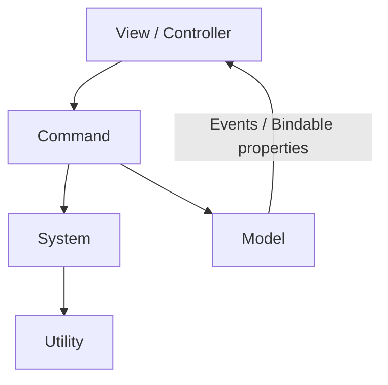

# QFramework fundamentals {#qframework}

QFramework owns business architecture and familiar high-level APIs. QHY installs
YooAsset adapters through extension points without editing its source.



Models hold state, Systems implement business rules, Commands represent intent,
and Utilities provide stateless services.

```csharp
var loader = QFramework.ResLoader.Allocate();
var prefab = loader.LoadSync<GameObject>("Player");
var instance = Object.Instantiate(prefab);
loader.Recycle2Cache();
```

The legacy `ownerBundle` argument is ignored for bundle lookup; the short name
resolves to a YooAsset Address. `UIKit.OpenPanel<LoginPanel>()`,
`AudioKit.PlaySound("ButtonClick")`, and `AudioKit.PlayMusic("BgmLobby")` use
QHY's YooAsset loaders after Boot.

Keep a loader for as long as its loaded assets are used. QFramework's native
scene helpers cannot be replaced non-invasively, so use `YooAssetSceneKit`.
