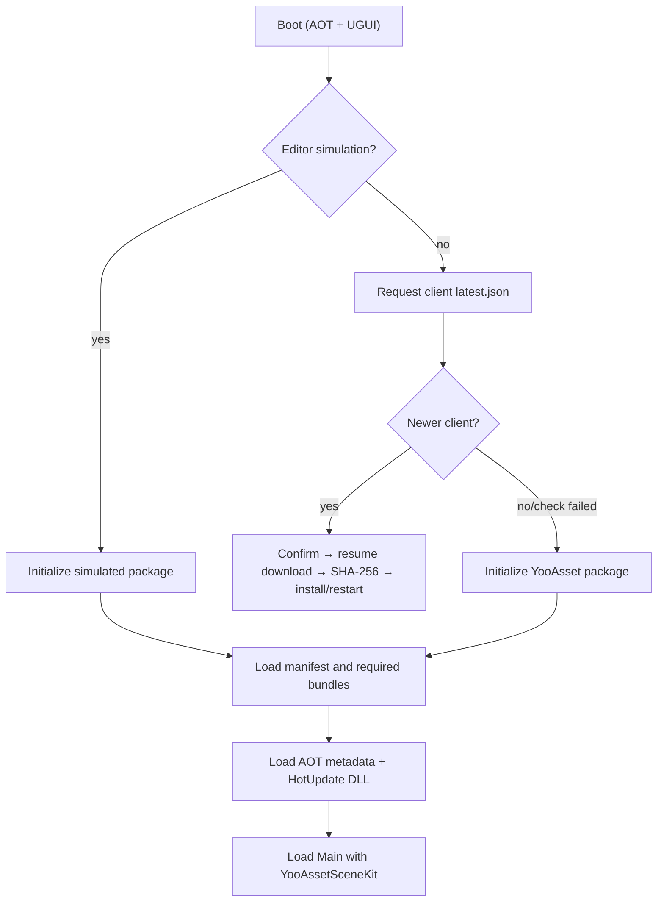

# QHY startup and update workflows {#qhy-workflows}

Client-manifest failure does not block the old client. Resource request failure
uses a valid cache when available. A mandatory newer client cannot enter Main
until installed.

HotUpdateOnly uploads resources under `/CDN/<Platform>/<Version>` and never
updates client `latest.json`. Full Package produces resources, client ZIP/APK,
and publishes `latest.json` last.
