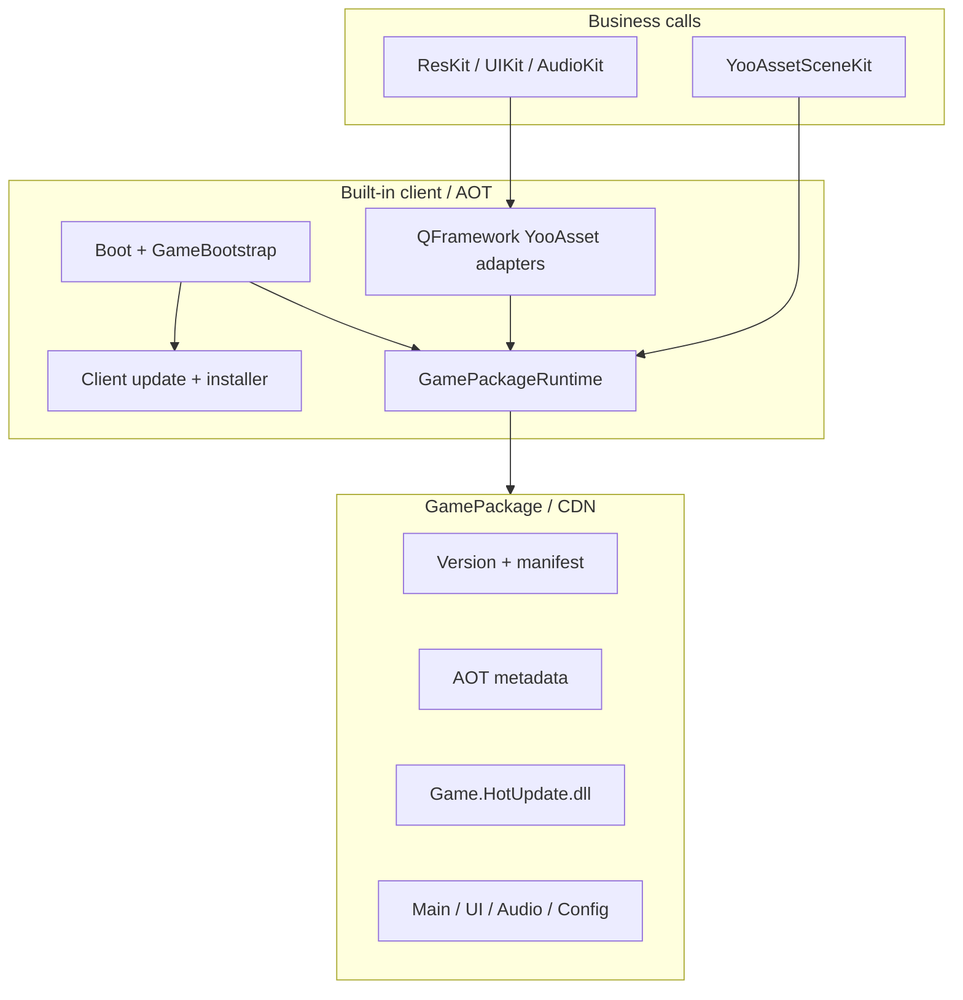

# Architecture and boundaries {#architecture}

Upstream packages remain unmodified. QHY owns AOT integration and Editor tools.
The host project owns Boot/BootUI, while business code/content is hot-updatable.
Server artifacts remain versioned and old directories stay available.
