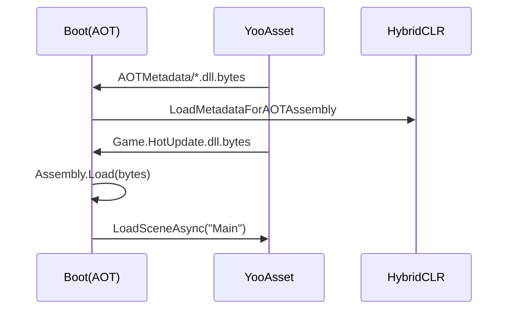

# HybridCLR fundamentals {#hybridclr}

- **AOT assemblies** are converted to native code by IL2CPP.
- **HotUpdate assemblies** are downloaded as YooAsset resources and loaded at runtime.
- **Supplemental metadata** supplies generic metadata; it does not replace native AOT code.
- **link.xml** preserves managed Player types or Unity Engine modules during linking; it
  does not supply HybridCLR generic metadata, and metadata cannot restore runtime code
  already stripped from the client.



Gameplay code and remote content usually use HotUpdateOnly. Boot, native
plugins, Player settings, and IL2CPP changes require Full Package.

An AOT difference produces a strong warning but does not block HotUpdateOnly.
You must still use metadata compatible with the target published client and
must not call new native AOT implementations that client does not contain.

## Local IL2CPP and native verification

The presence of managed `HybridCLR.RuntimeApi` does not prove that the Player
linked HybridCLR's native runtime. Full Package must use
`HybridCLRData/LocalIl2CppData-<EditorPlatform>/il2cpp`, which includes at least:

```text
libil2cpp/hybridclr/
build/deploy/il2cpp.exe        # Windows Editor
build/deploy/il2cpp            # macOS/Linux Editor
```

Some Unity layouts use `Unity.IL2CPP.dll`; QHY recognizes those too. Version
1.1.3 reasserts the local toolchain after every operation that may cause a
domain reload, then verifies HybridCLR interpreter code in Windows
`GameAssembly.dll` or Android `libil2cpp.so`.

A `MissingMethodException` from `RuntimeApi.LoadMetadataForAOTAssembly` usually
means the managed API entered the Player but the Player was built with Unity's
global IL2CPP. Re-uploading DLLs or metadata cannot repair that client. Upgrade
QHY and perform a new Full Package Build.

## link.xml and supplemental metadata are independent

External YooAsset bundles do not participate in the built-in scene's static type
analysis. If Boot references no animation while controllers and clips exist only in
bundles, Engine Stripping can remove `UnityEngine.AnimationModule` runtime support.
FullPackage generates an independent `Assets/Game/Generated/QHYLink/link.xml` for this
case; never patch `Assets/HybridCLRGenerate/link.xml`, which Generate/All replaces.

Projects may still add `UnityEngine.AnimationModule.dll` to the extra AOT metadata list
when hot-update code needs its AOT type metadata. That is HybridCLR metadata handling,
not Player stripping protection, and cannot replace
`<assembly fullname="UnityEngine.AnimationModule" preserve="all" />`.
