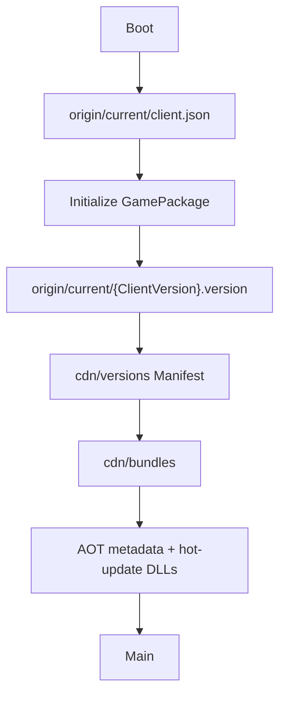

# QHY startup and update flow {#qhy-workflows}

A remote failure falls back only when a complete runnable cache exists. The last usable Manifest is
retained until its replacement validates.

FTP uploads immutable `cdn` files and `origin/qhy.json`, then activates `origin/current` and records Published. Manual
publication maps to `Upload/1-Files` followed by `Upload/2-Publish`, then Resource BaseURL
verification. CDN behavior is outside this state machine. HotUpdateOnly creates no APK/ZIP;
FullPackage updates `origin/current/client.json`.
