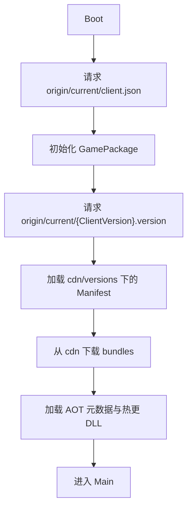
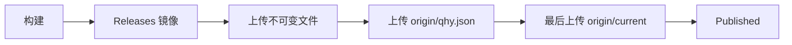

# QHY 启动与更新流程 {#qhy-workflows}

远端失败时仅在本地存在完整可运行缓存的情况下离线进入。Manifest 验证成功前保留最后可用
版本，不删除回退所需文件。

FTP 自动执行上述顺序。手动发布对应 `Upload/1-Files` 和 `Upload/2-Publish`；分别通过
CDN Root 与 Origin Root 检查后登记 Published。CDN 不在发布状态机中。
HotUpdateOnly 不生成 APK/ZIP；FullPackage 才更新 `origin/current/client.json`。
